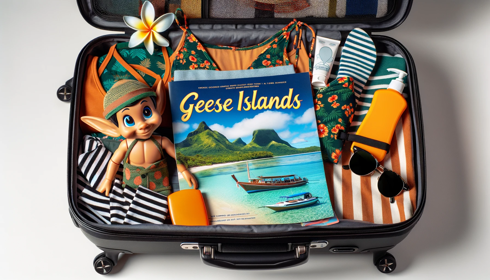

# Writeup for The 2023 SANS Holiday Hack Challenge: A Holiday Odyssey \| Featuring 6: Geese A-Lei'ing!
## Luggage Lock
Difficulty: :christmas_tree:    
Help Garland Candlesticks on the Island of Misfit Toys get back into his luggage by finding the correct position for all four dials.

### Hints
#### Lock Talk
*From: Garland Candlesticks*  
Check out Chris Elgee's [talk](https://youtu.be/ycM1hBSEyog) regarding his and his wife's luggage. Sounds weird but interesting!

### The “right” solution
Given the great talk it is easy to replicate the steps by applying pressure to the TSA keyhole (highlighted
in yellow in the image below), then rotate the wheels and mind the resistances until the proper code is
found.


Once opened, the inside reveals a pretty nifty holiday luggage:


### The “wrong” solution
While impractical and hardly applicable in a real-life scenario, in this instance we can use a quick javascript one-liner directly in the developer tools’ console to test all the combinations and unlock the luggage in a matter of moments:
```javascript
for(a=0;a<10;a++)for(b=0;b<10;b++)for(c=0;c<10;c++)for(d=0;d<10;d++)socket.emit('message',{
"Type":"Open","Combo":""+a+b+c+d });
```

### Kudos
Seriously, it was so nice to see challenges about lockpicking - especially having to replicate them “digitally”. Kudos!