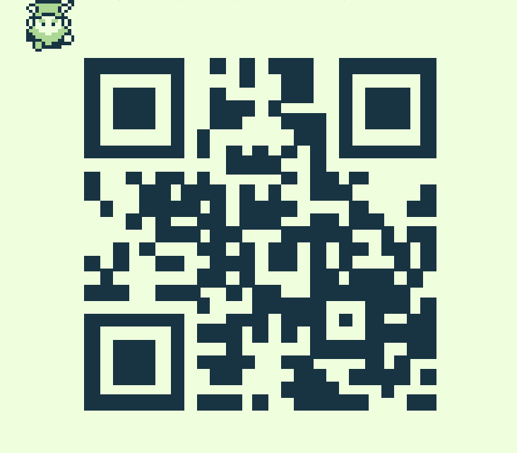

# Writeup for The 2023 SANS Holiday Hack Challenge: A Holiday Odyssey \| Featuring 6: Geese A-Lei'ing!
## Game Cartridges: Vol 1
Difficulty: :christmas_tree:  
Find the first Gamegosling cartridge and beat the game

### Hints
#### Approximate Proximity
*From: Dusty Giftwrap*  
Listen for the gameboy cartridge detector's proximity sound that activates when near buried treasure. It may be worth checking around the strange toys in the Tarnished Trove.
#### Gameboy 1
*From: Dusty Giftwrap (after obtaining the cartridge)*  
1) Giving things a little push never hurts. 
2) Out of sight but not out of ear-shot 
3) You think you fixed the QR code? Did you scan it and see where it leads?

### Solution
Analyzing the HTML code, it is possible to find references to the cartridge and then it is just a matter of
navigating to that position:
```html
<div class="ent type-item item-gameboy1 p-31-25" data-location="31,25">
```
Once found, under Luffy’s hat (), this cartridge is actually easier to play than to hack, so, once the QR is fixed it is show in its entirety:
  
The QR code points to http://8bitelf.com, accessing it allows obtaining the flag `santaconfusedgivingplanetsqrcode`.

---
## [Game Cartridges: Vol 2](/10%20-%20Game%20Cartridges%3A%20Vol%202/README.md)
## [Game Cartridges: Vol 3](/11%20-%20Game%20Cartridges%3A%20Vol%203/README.md)
## [Na'an](/12%20-%20Na%27an/README.md)
## [KQL Kraken Hunt](/13%20-%20KQL%20Kraken%20Hunt/README.md)
## [Phish Detection Agency](/14%20-%20Phish%20Detection%20Agency/README.md)
## [Hashcat](/15%20-%20Hashcat/README.md)
## [Elf Hunt](/16%20-%20Elf%20Hunt/README.md)
## [Certificate SSHenanigans](/17%20-%20Certificate%20SSHenanigans/README.md)
## [The Captain's Comms](/18%20-%20The%20Captain%27s%20Comms/README.md)
## [Active Directory](/19%20-%20Active%20Directory/README.md)
## [Space Island Door Access Speaker](/20%20-%20Space%20Island%20Door%20Access%20Speaker/README.md)
## [Camera Access](/21%20-%20Camera%20Access/README.md)
## [Missile Diversion](/22%20-%20Missile%20Diversion/README.md)
## [BONUS! Fishing Guide](/23%20-%20BONUS%21%20Fishing%20Guide/README.md)
## [BONUS! Fishing Mastery](/24%20-%20BONUS%21%20Fishing%20Mastery/README.md)
## [Conclusions](/README.md#conclusions)
---
## [thedead@dellian:~$ whoami](/README.md#thedeaddellian-whoami)
## [Holiday Hack Orientation](/01%20-%20Holiday%20Hack%20Orientation/README.md)
## [Snowball Fight](/02%20-%20Snowball%20Fight/README.md)
## [Linux 101](/03%20-%20Linux%20101/README.md)
## [Reportinator](/04%20-%20Reportinator/README.md)
## [Azure 101](/05%20-%20Azure%20101/README.md)
## [Luggage Lock](/06%20-%20Luggage%20Lock/README.md)
## [Linux PrivEsc](/07%20-%20Linux%20PrivEsc/README.md)
## [Faster Lock Combination](/08%20-%20Faster%20Lock%20Combination/README.md)