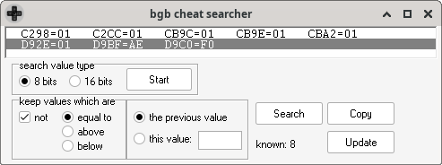
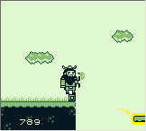

# Writeup for The 2023 SANS Holiday Hack Challenge: A Holiday Odyssey \| Featuring 6: Geese A-Lei'ing!
## Game Cartridges: Vol 3
Difficulty: :christmas_tree::christmas_tree::christmas_tree:  
Find the third Gamegosling cartridge and beat the game

### Hints
#### Bird's Eye View
*From: Angel Candysalt*  
The location of the treasure in Rusty Quay is marked by a shiny spot on the ground. To help with navigating the maze, try zooming out and changing the camera angle.
#### Gameboy 3
*From: Angel Candysalt (after obtaining the cartridge)*  
1) This one is a bit long, it never hurts to save your progress! 
2) 8bit systems have much smaller registers than you’re used to. 
3) Isn’t this great?!? The coins are OVERFLOWing in their abundance.

### Solution
By zooming out in the screen, the path to the cartridge is revealed, and highlighted in green in the image below:
  
When saving coins are lost and can be restored with T-Wiz’s help. Using the bgb cheat searcher I eventually identified the registries that were changing/not changing accordingly to what was happening in the game:
  
With some further analysis I was able to identify those holding the actual coin value: `CBA2` being the units, `CB9C` being the tens and `CB9E` being the hundreds. Then playing till the end of the game and setting coins to `999` (at least in memory) new sprites appear:
|                      |                                |
| -------------------- | ------------------------------ |
|  |  |

Once crossed the gap we meet a Grumpy Man that tells us the password `morethanmeetstheeye` for ChatNPT which sets the variable `ROCKCANMOVE` to `TRUE`, allowing us to move the rock and obtain the final flag `!tom+elf!`.

#### Wrong path #1 - Overflowing
I have tried to work around the overflowing of coins for so many hours that I cannot even remember before trying to just play the game.
#### Wrong path #2 - Save games
I have also analyzed save games for such a long time...but I discovered a guide that I think it’s worth sharing with the world: [Carter Yagemann - A Beginner's Guide to Hacking Video Game Save States](https://carteryagemann.com/save-state-hacking-for-beginners.html).
#### Wrong path #3 - Phantom tiles
This was probably where I got into the deepest white rabbit’s hole: trying to add terrain so that I could just fill the gap. Never got it working, always ending up on unwalkable phantom tiles...but also here I discovered a crazily interesting guide that I wanted to share: [Bruno Macabeus - Reverse engineering a GameBoy Advance game](https://macabeus.medium.com/reverse-engineering-a-gameboy-advance-game-introduction-ec185bd8e02).

---
## [Na'an](/12%20-%20Na%27an/README.md)
## [KQL Kraken Hunt](/13%20-%20KQL%20Kraken%20Hunt/README.md)
## [Phish Detection Agency](/14%20-%20Phish%20Detection%20Agency/README.md)
## [Hashcat](/15%20-%20Hashcat/README.md)
## [Elf Hunt](/16%20-%20Elf%20Hunt/README.md)
## [Certificate SSHenanigans](/17%20-%20Certificate%20SSHenanigans/README.md)
## [The Captain's Comms](/18%20-%20The%20Captain%27s%20Comms/README.md)
## [Active Directory](/19%20-%20Active%20Directory/README.md)
## [Space Island Door Access Speaker](/20%20-%20Space%20Island%20Door%20Access%20Speaker/README.md)
## [Camera Access](/21%20-%20Camera%20Access/README.md)
## [Missile Diversion](/22%20-%20Missile%20Diversion/README.md)
## [BONUS! Fishing Guide](/23%20-%20BONUS%21%20Fishing%20Guide/README.md)
## [BONUS! Fishing Mastery](/24%20-%20BONUS%21%20Fishing%20Mastery/README.md)
## [Conclusions](/README.md#conclusions)
---
## [thedead@dellian:~$ whoami](/README.md#thedeaddellian-whoami)
## [Holiday Hack Orientation](/01%20-%20Holiday%20Hack%20Orientation/README.md)
## [Snowball Fight](/02%20-%20Snowball%20Fight/README.md)
## [Linux 101](/03%20-%20Linux%20101/README.md)
## [Reportinator](/04%20-%20Reportinator/README.md)
## [Azure 101](/05%20-%20Azure%20101/README.md)
## [Luggage Lock](/06%20-%20Luggage%20Lock/README.md)
## [Linux PrivEsc](/07%20-%20Linux%20PrivEsc/README.md)
## [Faster Lock Combination](/08%20-%20Faster%20Lock%20Combination/README.md)
## [Game Cartridges: Vol 1](/09%20-%20Game%20Cartridges%3A%20Vol%201/README.md)
## [Game Cartridges: Vol 2](/10%20-%20Game%20Cartridges%3A%20Vol%202/README.md)
