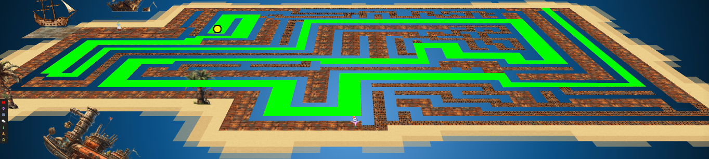

# Writeup for The 2023 SANS Holiday Hack Challenge: A Holiday Odyssey \| Featuring 6: Geese A-Lei'ing!
## Game Cartridges: Vol 3
Difficulty: :christmas_tree::christmas_tree::christmas_tree:
Find the third Gamegosling cartridge and beat the game

### Hints
#### Bird's Eye View
*From: Angel Candysalt*
The location of the treasure in Rusty Quay is marked by a shiny spot on the ground. To help with navigating the maze, try zooming out and changing the camera angle.
#### Gameboy 3
*From: Angel Candysalt (after obtaining the cartridge)*
1) This one is a bit long, it never hurts to save your progress! 2) 8bit systems have much smaller registers than you’re used to. 3) Isn’t this great?!? The coins are OVERFLOWing in their abundance.

### Solution
By zooming out in the screen, the path to the cartridge is revealed, and highlighted in green in the image
below:
