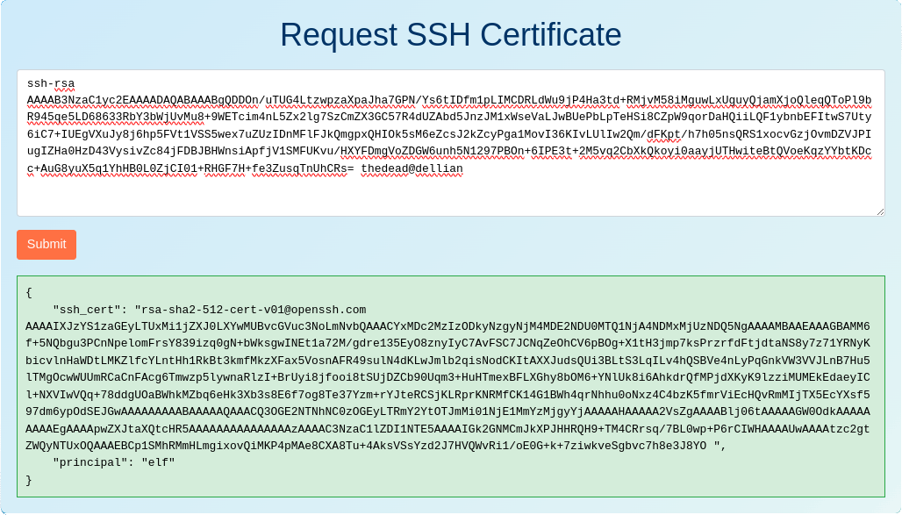

# Writeup for The 2023 SANS Holiday Hack Challenge: A Holiday Odyssey \| Featuring 6: Geese A-Lei'ing!
## Certificate SSHenanigans
Difficulty: :christmas_tree::christmas_tree::christmas_tree::christmas_tree::christmas_tree:  
Go to Pixel Island and review Alabaster Snowball's new SSH certificate configuration and Azure [Function App](https://northpole-ssh-certs-fa.azurewebsites.net/api/create-cert?code=candy-cane-twirl). What type of cookie cache is Alabaster planning to implement?

### Hints
#### Azure VM Access Token
*From: Sparkle Redberry*  
Azure CLI tools aren't always available, but if you're on an Azure VM you can always use the [Azure REST API](https://learn.microsoft.com/en-us/entra/identity/managed-identities-azure-resources/how-to-use-vm-token) instead.
#### SSH Certificates Talk
*From: Alabaster Snowball*  
Check out Thomas Bouve's [talk and demo](https://youtu.be/4S0Rniyidt4) to learn all about how you can upgrade your SSH server configuration to leverage SSH certificates.
#### Azure Function App Source Code
*From: Alabaster Snowball*  
The [get-source-control](https://learn.microsoft.com/en-us/rest/api/appservice/web-apps/get-source-control) Azure REST API endpoint provides details about where an Azure Web App or Function App is deployed from.

### Solution
Talking to Alabaster Snowball, he gives additional information about the challenge:
* The ssh-server-vm.santaworkshopgeeseislands.org azure server
* Restates the [Azure Function App](https://northpole-ssh-certs-fa.azurewebsites.net/api/create-cert?code=candy-cane-twirl) allowing elves to request their own SSH certificates
* Instructs to use the monitor account to access the host
* Points out the to try obtaining the contents of his TODO list

First thing is to generate a dedicated SSH key:
```bash
thedead@dellian:~/hhc2023/Certificate SSHenanigans$ ssh-keygen -f hhc2023
Generating public/private rsa key pair.
# Output removed to shorten report
Your identification has been saved in hhc2023
Your public key has been saved in hhc2023.pub
The key fingerprint is:
SHA256:lcvFbYD3/mgiNJohS1tokhTa0duNE35uHGReft2vRsk thedead@dellian
# Output removed to shorten report
```

Then upload the public key to the abovementioned Azure Function App to obtain a certificate file:


Save the certificate to a dedicated file (`hhc2023.cert` in my case), fix permissions if needed and log in to the ssh server using these credentials:
```bash
thedead@dellian:~/hhc2023/Certificate SSHenanigans$ chmod 0600 hhc2023.cert
thedead@dellian:~/hhc2023/Certificate SSHenanigans$ ssh -i hhc2023.cert -i hhc2023 monitor@ssh-server-vm.santaworkshopgeeseislands.org
┌──────────────── Satellite Tracking Interface ────────────────┐
│            ____     __ ______             __                 │
│           / __/__ _/ //_  __/______ _____/ /__ ____          │
│          _\ \/ _ `/ __// / / __/ _ `/ __/  '_// __/          │
│         /___/\_,_/\__//_/ /_/  \_,_/\__/_\_\/_/              │
│                                                              │
╞══════════════════════════════════════════════════════════════╡
│                                                              │
│  Position: 1.145132°, -145.261627°                           │
│  Velocity: 3.0690 km/s                                       │
│  Altitude: 35785.97 km above Earth's surface                 │
│  Signal Strength: 87.45%                                     │
│  Solar Panel Status: Deployed                                │
│  Battery Status: Unknown                                     │
│  Thermal Status: Unknown                                     │
│                                                              │
│          **** Geostationary orbit detected! ****             │
│                                                              │
└──────────────────────────────────────────────────────────────┘
```