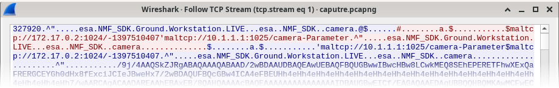
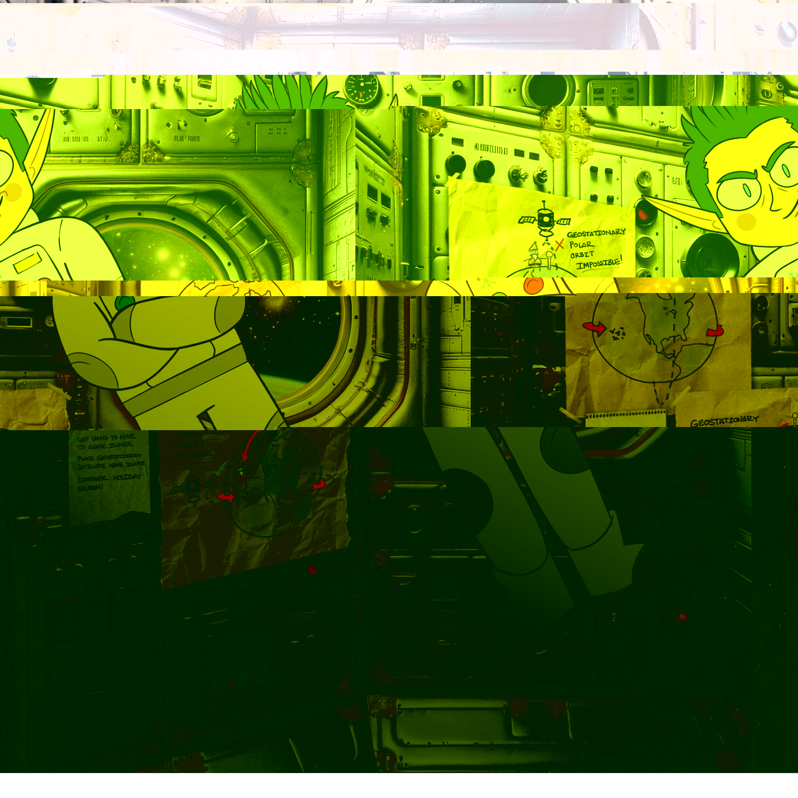

# Writeup for The 2023 SANS Holiday Hack Challenge: A Holiday Odyssey \| Featuring 6: Geese A-Lei'ing!
## Camera Access
Difficulty: :christmas_tree::christmas_tree::christmas_tree:  
Gain access to Jack's camera. What's the third item on Jack's TODO list?

### Hints
#### Hubris is a Virtue
*From: Wombley Cube*  
In his hubris, Wombley revealed that he thinks you won't be able to access the satellite's "Supervisor Directory". There must be a good reason he mentioned that specifically, and a way to access it. He also said there's someone else masterminding the whole plot. There must be a way to discover who that is using the nanosat.

### Solution
The NanoSat-o-Matic allows downloading a pre-built [container](https://www.holidayhackchallenge.com/2023/client_container.zip) with all the required tools inside that can be access via VNC. The GateXOR Gator provides the configuration for a Wireguard VPN connection to the target. The references to NanoSat, along with the tools provided within the container, leads to [ESA’s NanoSat MO Framework](https://nanosat-mo-framework.github.io/). Once the interface was set up, I used nmap to determine useful ports on the target:
```bash
thedead@dellian:~/hhc2023/Camera Access$ nmap 10.1.1.1
Starting Nmap 7.93 ( https://nmap.org ) at 2023-12-24 16:07 CET
Nmap scan report for 10.1.1.1
Host is up (0.18s latency).
Not shown: 998 closed tcp ports (conn-refused)
PORT     STATE SERVICE
1024/tcp open  kdm
3306/tcp open  mysql
```

I then used the `Consumer Test Tool` to connect to `maltcp://10.1.1.1:1024/nanosat-mo-supervisor-Directory`, I noticed the `camera` app and started it. I then connected to `maltcp://10.1.1.1:1025/camera-Directory`. This exposed the action service `Base64SnapImage` to get a photo along with two parameter services: `NumberOfSnapsTaken` and `Base64SnapImage` to get the base64 encoded content of the image. After submitting the action `Base64SnapImage`, I noticed that `NumberOfSnapsTaken` increased and `Base64SnapImage` had some content. Due to the challenging interface of the CTT, I captured the traffic with Wireshark on the host and extracted the Base64 encoded payload:


Once converted to an image I got this:


It’s not beautiful but I could find the TODO list with the third item being `CONQUER HOLIDAY SEASON!`:


---
## [Missile Diversion](/22%20-%20Missile%20Diversion/README.md)
## [BONUS! Fishing Guide](/23%20-%20BONUS%21%20Fishing%20Guide/README.md)
## [BONUS! Fishing Mastery](/24%20-%20BONUS%21%20Fishing%20Mastery/README.md)
## [Conclusions](/README.md#conclusions)
---
## [thedead@dellian:~$ whoami](/README.md#thedeaddellian-whoami)
## [Holiday Hack Orientation](/01%20-%20Holiday%20Hack%20Orientation/README.md)
## [Snowball Fight](/02%20-%20Snowball%20Fight/README.md)
## [Linux 101](/03%20-%20Linux%20101/README.md)
## [Reportinator](/04%20-%20Reportinator/README.md)
## [Azure 101](/05%20-%20Azure%20101/README.md)
## [Luggage Lock](/06%20-%20Luggage%20Lock/README.md)
## [Linux PrivEsc](/07%20-%20Linux%20PrivEsc/README.md)
## [Faster Lock Combination](/08%20-%20Faster%20Lock%20Combination/README.md)
## [Game Cartridges: Vol 1](/09%20-%20Game%20Cartridges%3A%20Vol%201/README.md)
## [Game Cartridges: Vol 2](/10%20-%20Game%20Cartridges%3A%20Vol%202/README.md)
## [Game Cartridges: Vol 3](/11%20-%20Game%20Cartridges%3A%20Vol%203/README.md)
## [Na'an](/12%20-%20Na%27an/README.md)
## [KQL Kraken Hunt](/13%20-%20KQL%20Kraken%20Hunt/README.md)
## [Phish Detection Agency](/14%20-%20Phish%20Detection%20Agency/README.md)
## [Hashcat](/15%20-%20Hashcat/README.md)
## [Elf Hunt](/16%20-%20Elf%20Hunt/README.md)
## [Certificate SSHenanigans](/17%20-%20Certificate%20SSHenanigans/README.md)
## [The Captain's Comms](/18%20-%20The%20Captain%27s%20Comms/README.md)
## [Active Directory](/19%20-%20Active%20Directory/README.md)
## [Space Island Door Access Speaker](/20%20-%20Space%20Island%20Door%20Access%20Speaker/README.md)
