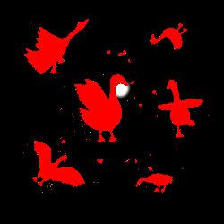

# Writeup for The 2023 SANS Holiday Hack Challenge: A Holiday Odyssey \| Featuring 6: Geese A-Lei'ing!
## BONUS! Fishing Mastery
Difficulty: :christmas_tree::christmas_tree::christmas_tree::christmas_tree:  
Catch at least one of each species of fish that live around Geese islands. When you're done, report your findings to Poinsettia McMittens.

### Hints
#### I Am Become Data
*From: Poinsettia McMittens*
One approach to automating web tasks entails the browser's developer console. Browsers' console allow us to manipulate objects, inspect code, and even interact with [websockets](https://javascript.info/websocket).
#### Fishing Machine
*From: Poinsettia McMittens*
There are a variety of strategies for automating repetative website tasks. Tools such as [AutoKey](https://github.com/autokey/autokey) and [AutoIt](https://www.autoitscript.com/site/) allow you to programmatically examine elements on the screen and emulate user inputs.

### Solution
I let my script run for quite a while but I wasn’t able to obtain all the fish, so I looked at the images I downloaded from https://2023.holidayhackchallenge.com/sea/fishdensityref.html. I understood that white gradient in the image would indicate where a fish could be found. I started overlapping the density with the [minimap](https://2023.holidayhackchallenge.com/sea/assets/minimap.png) and thought about automating the whole process of moving & catching for each fish. When doing that I noticed the Piscis Cyberneticus Skodo having a really narrow catching area that can be seen in white in the image below:  

While working on a new version, I let my old script run with the boat in the fishing area for the Piscis Cyberneticus Skodo. Eventually the night passed and I woke up having all 171 fish. The Piscis itself was catched #170 and the last one was actually a Whiskered Jumblefish 🙂

---
## [Conclusions](/README.md#conclusions)
---
## [thedead@dellian:~$ whoami](/README.md#thedeaddellian-whoami)
## [Holiday Hack Orientation](/01%20-%20Holiday%20Hack%20Orientation/README.md)
## [Snowball Fight](/02%20-%20Snowball%20Fight/README.md)
## [Linux 101](/03%20-%20Linux%20101/README.md)
## [Reportinator](/04%20-%20Reportinator/README.md)
## [Azure 101](/05%20-%20Azure%20101/README.md)
## [Luggage Lock](/06%20-%20Luggage%20Lock/README.md)
## [Linux PrivEsc](/07%20-%20Linux%20PrivEsc/README.md)
## [Faster Lock Combination](/08%20-%20Faster%20Lock%20Combination/README.md)
## [Game Cartridges: Vol 1](/09%20-%20Game%20Cartridges%3A%20Vol%201/README.md)
## [Game Cartridges: Vol 2](/10%20-%20Game%20Cartridges%3A%20Vol%202/README.md)
## [Game Cartridges: Vol 3](/11%20-%20Game%20Cartridges%3A%20Vol%203/README.md)
## [Na'an](/12%20-%20Na%27an/README.md)
## [KQL Kraken Hunt](/13%20-%20KQL%20Kraken%20Hunt/README.md)
## [Phish Detection Agency](/14%20-%20Phish%20Detection%20Agency/README.md)
## [Hashcat](/15%20-%20Hashcat/README.md)
## [Elf Hunt](/16%20-%20Elf%20Hunt/README.md)
## [Certificate SSHenanigans](/17%20-%20Certificate%20SSHenanigans/README.md)
## [The Captain's Comms](/18%20-%20The%20Captain%27s%20Comms/README.md)
## [Active Directory](/19%20-%20Active%20Directory/README.md)
## [Space Island Door Access Speaker](/20%20-%20Space%20Island%20Door%20Access%20Speaker/README.md)
## [Camera Access](/21%20-%20Camera%20Access/README.md)
## [Missile Diversion](/22%20-%20Missile%20Diversion/README.md)
## [BONUS! Fishing Guide](/23%20-%20BONUS%21%20Fishing%20Guide/README.md)