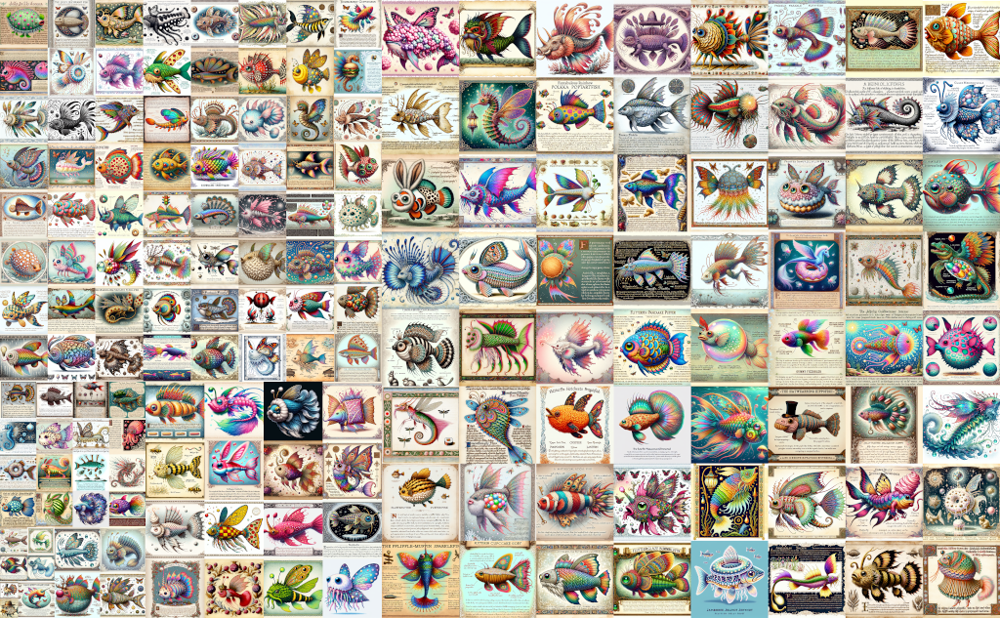

# Writeup for The 2023 SANS Holiday Hack Challenge: A Holiday Odyssey \| Featuring 6: Geese A-Lei'ing!

## thedead@dellian:~$ whoami
```bash
thedead@dellian:~$ whoami

Andrea Lamonato - Cyber Security Engineer

mailto: lamonato.andrea@gmail.com
Github: https://github.com/LamonatoAndrea
Linkedin: https://www.linkedin.com/in/andrea-lamonato/

       ___  ___     _____     _____     
       |  \/  |    |_   _|   |_   _|         
       | .  . |      | |       | |           
       | |\/| |      | |       | |           
       | |  | |  _   | |  _   _| |_  _       
       \_|  |_/ (_)  \_/ (_)  \___/ (_)      
               _                         _     
              | |                       (_)    
   _ __   ___ | |_    __ _   _   _ _ __  _     
  | '_ \ / _ \| __|  / _` | | | | | '_ \| |    
  | | | | (_) | |_  | (_| | | |_| | | | | |    
  |_| |_|\___/ \__|  \__,_|  \__,_|_| |_|_|    
  __ _ _ __   __ _  __ _ _ __ __ _ _ __ ___  
 / _` | '_ \ / _` |/ _` | '__/ _` | '_ ` _ \ 
| (_| | | | | (_| | (_| | | | (_| | | | | | |
 \__,_|_| |_|\__,_|\__, |_|  \__,_|_| |_| |_|
                    __/ |                    
                   |___/                     
```

## [Holiday Hack Orientation](/01%20-%20KringleCon%20Orientation/README.md)

## Conclusions
Hey folks, nice seeing you again! This is like the 5th year in a row, it starts to become a habit. Thanks for this year’s challenge: Jack is back! Obviously AI was used along the whole thing, to write code and
especially to FORMAT IT - such a time saver! Those GB challenges were NICE and coincidentally I
just recently started playing Pokemon Black with the Lemuroid emulator, I don’t think I’ll play anything
similar to a GameBoy for a while now! KUDOS again for the effort, I would have never expected lockpicking or satellite challenges! As someone said [Every Rose Has Its Thorn](https://www.youtube.com/watch?v=j2r2nDhTzO4) and for me it was [The Captain's Comms](https://github.com/LamonatoAndrea/KringleCon5/tree/master/04%20-%20Recover%20the%20Web%20Ring/04.06%20-%20Glamtariel's%20Fountain). I would much rather spend days & nights getting defeated by Game Cartridges: Vol 2 than trying to guess a filename, but that’s me. So...till we meet each other next year!

### Gotta fit ‘em all
As this year I could not give you many memes, I wrote a quick downloader that given a JSON of all fishes,
obtainable from one of the `i:` websockets message. The following script can download all the images:
```python
import requests
import shutil
import json

base_url = "https://2023.holidayhackchallenge.com/sea/assets/fish/{}.png"
fishes = json.load(open('fish.json', 'r'))

for fish in fishes:
       r = requests.get(base_url.format(fish['hash']), stream=True)
       if r.status_code == 200:
              with open('download/{}_{}.png'.format(fish['name'], fish['hash']), 'wb') as f:
                     r.raw.decode_content = True
                     shutil.copyfileobj(r.raw, f)
                     print("Saved [{}]".format(fish['name']))
```
Then Gimp’ed it and here I leave you with this nice fish picture. I wanted this to be the last thing you’d see in the report. Say hi to Piscis Cyberneticus Skodo (aka Ed Skoudis) for me and drop me an email if you’d like the image. It has been kind of a thing the last 2 years

